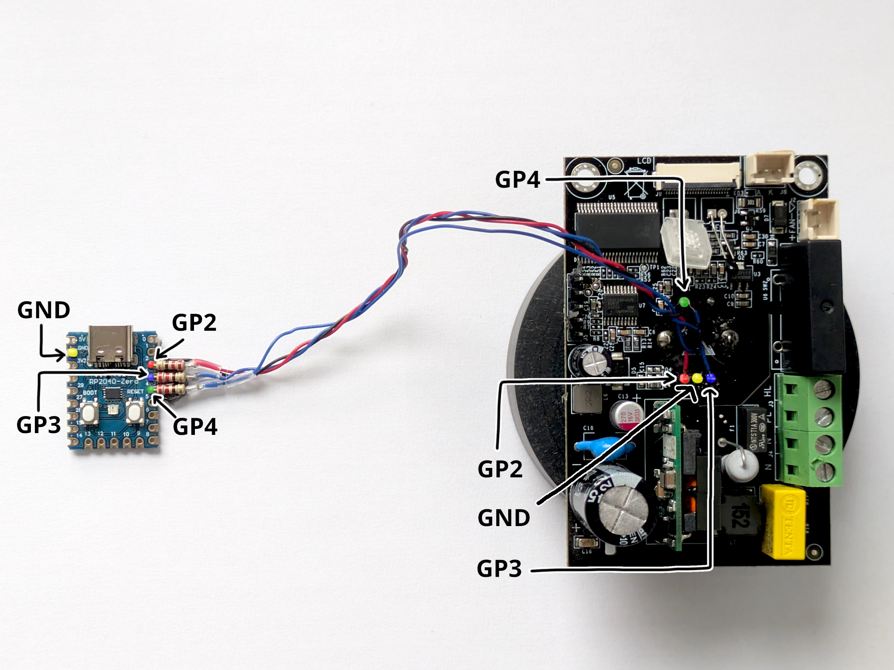

# dryer_cntrl

`dryer_cntrl` (for lack of a better name) is a low-cost, hands-free solution for controlling and
automating the
[Creality Filament Dry Box 2.0](https://store.creality.com/products/creality-filament-dry-box-2-0).


The solution is based on [RP2040-zero](www.waveshare.com/wiki/RP2040-Zero) development board and
relies on emulating movement of the encoder, the host circuit has no knowledge it is controlled by
another microcontroller. The modification allows for controlling the dryer via UART. This makes the
solution quite flexible, as it can be connected to any host (even to the printer) and easily
automated if needed.

The solution has its purpose in remote 3D printer setup, to provide hands-free operation of the
dryer.

## Blog post

Learn about how this project came to be from
[this blog post](https://danceswithmachines.github.io/posts/handsfree-controling-creality-drybox-20/).

## Components needed

For the modification you'll need following components:
* RP2040-zero or its clone,
* 3x 220Ω resistors,
* some wire and heat-shrinks.

That's really it! If you're feeling fancy or just want to keep the solution "clean" you can print
[the mount for rp2040-zero](https://www.thingiverse.com/thing:7086411) I designed. Use some
heat-resistant filament like ABS.

## Obtaining firmware

You can grab the newest firmware form releases tab on this repo or build the binaries yourself.

### Building the firmware

To build the firmware you'll need [Arduino Ide](https://www.arduino.cc/en/software/) and install
[Earle Philhower's arudino-pico](https://github.com/earlephilhower/arduino-pico) Raspberry Pi Pico
Arduino core in the board manager. Then select target board to `RP2040-zero` and use
`Export Compiled Binary` under `Sketch` to create the firmware file. This will create `build`
directory and `.uf2` firmware file inside.

### Flashing the firmware

Plug the RP2040-zero to your PC while holding down "boot" button, or if you already got it connected,
press and hold the boot button and single press reset at the same time. Doing any of the above will
put the board into flash mode, and it'll be exposed as a flash drive on your system. Drag and drop
the firmware file. When copied, the device will disconnect.

## Disassembling the dryer

### Disclaimer

**Warning! Everything I described below, you're doing at your own risk. I do not take responsibility
for you breaking your device or hurting yourself! The PCB operates at mains voltage, make sure the
device is disconnected from the outlet when disassembling or assembling the dryer. Run the device
only if all core components are secured where they belong and don't put any part of your body inside
the device when it's turned on!**

### Step-by-step instruction

#### Precaution

**Disconnect the device from the power outlet!**

#### Step 1

Start disassembling the dryer by removing 4 screws on the inside. The screws are marked on the
picture below.


Then remove heat insulation from the front and the back to remove the cover. The insulation will get
damaged during this process, so you'll need to buy yourself a new sheet and cut it to size.

With one hand gently pry on sidewalls, and with the other hand gently pull the cover up by the
rollers. Prying is needed, as cover will likely get stuck on the heat isolation on the side walls.

**NOTE: Do not look inside while removing the cover or cover your eyes with safety goggles!**  
The rollers are designed to pop out with enough force and can hurt your eyes or face if you're not
careful.

#### Step 2

Next step is to remove the core components.


Start by removing the fan. Unscrew the bolts holding the fan. You'll likely be unable to remove
the fan connector as it is glued in place. You can skip unplugging it until the PCB is free, so the
glue can be removed first. Move the fan aside, so you can access the latch that secures the screen
ribbon cable.

Unsecure the ribbon cable by pulling the latch with our nail or a prying tool. The picture below
shows the latch in open position as well as encoder connections between microcontroller and the
encoder.


Remove the ribbon cable out of the connector.

Now unsecure the heater. The screws holding it down are accessible from the bottom of the device,
and they are hidden under the big sticker. The heater connector is also glued in, so you can skip
unplugging it until the PCB is free.

Remove two screws holding down the PCB. Remove the dial, and the encoder screw securing the PCB on
the front, as shown in below picture.


All core components shall be free at this stage. Lay the device on it's side and gently pull out the
components out of the case, so you can have better access to it.
**Remember they are still attached by wires!**

Now you can unscrew the terminals but first take a picture of the PCB to know how the wires go back
together! This will free the heating element.

Gently remove the glue from the fan and backlight connectors. I used knife to do so but something
pointy like toothpick might work as well. Unplug the connectors.

All 3 core components (pcb, heater, fan) should now be separated and can be pulled out of the case.

## Performing the modification

The following picture shows how to wire `RP2040-zero` to the dryer PCB.



**Note: 220Ω resistors should be soldered inline on the GPx pins.**

Pin roles:

| Color | RP2040-zero Pin | Role           |
|-------|-----------------|----------------|
| 🟡    | GND             | Common Ground  |
| 🔴    | GP2             | Encoder Pin A  |
| 🔵    | GP3             | Encoder Pin B  |
| 🟢    | GP4             | Encoder Switch |


The detailed [RP2040-zero pinout](https://www.waveshare.com/wiki/RP2040-Zero) can be found on
Waveshare wiki.

## Mounting the RP2040-zero

_Note: I don't claim this is a perfect solution. Feel free to do this your own way._

To mount RP2040-zero, one can use the
[3d-printable shelve mount](https://www.thingiverse.com/thing:7086411) I designed. The shelf
must be printed from heat resistant material like ABS.

A 10x20mm hole must be cut in the case with rotary tool, where there no other components inside.
Then the shelf can be glued from the outside, and the development board can be popped into the
place.

Some pictures showing the solution can be found below.


## Using the solution

### Connecting the device

The device when plugged to the computer should create virtual UART port. On Mac for example,
the name of the device will be likely to have "cu.usbmodem" prefix. Any terminal emulator with UART
support (like [minicom](https://linux.die.net/man/1/minicom)) shall be sufficient for base
operations.

The default baud-rate is: `115200`.  
Remember to disable hardware flow control.

```log
$ ls /dev/cu.usbmodem*
/dev/cu.usbmodem1101
$ minicom -D /dev/cu.usbmodem* -b 115200
```

While the device can be operated from command line directly, the dryer can be further automated via
custom shell script that would send commands and read the responses from UART.

### Using the device

The solution operates in shell mode. It prints back user input so enabling local echo is not needed.
For every command send the device shall print either `OK` when command succeeded or `ERR:<reason>`
if the command failed.

To verify the device is working send an empty line to the device, it shall respond with `OK`.

The detailed operation manual is embedded into the device. Send `help` command to learn the
operation.


## Licenses

This project is distributed under BSD-3 license. Refer to `LICENSE` for more information.

### 3-rd party licenses

This project is built on
[Earle Philhower's arduino-pico core (LGPL-2.1 licensed)](https://github.com/earlephilhower/arduino-pico).
The source code is not shared directly but built firmware naturally embeds the solution. The Arduino
build system does not output object files. See `LICENSE.LGPL-2.1.txt` for more information.